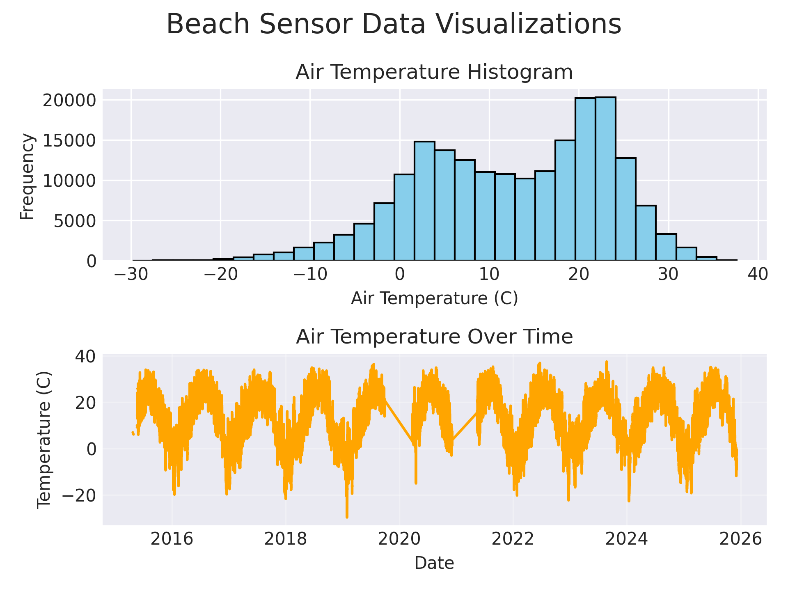
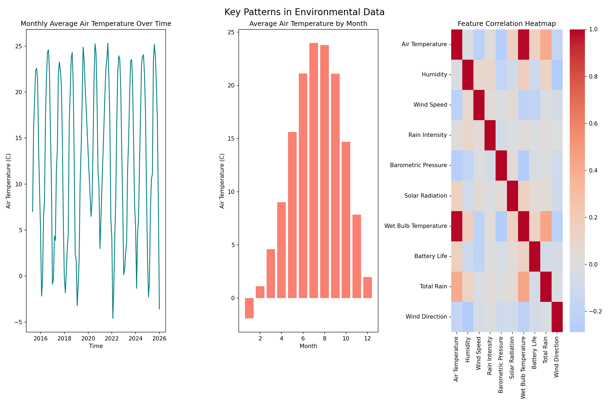

# # Chicago Beach Weather Sensors Analysis

## Executive Summary
This analysis is to examine the Beach Weather Stations data from the Chicago Park district. It covers around 197,000 hour measurements from May 2015 to December 2025 across the different weather stations. This analysis helps build predictive models for air temperature. Some key findings include seasonal and temporal patterns, and the prediction models. The best performing model was the XGBoost model, with a test R² of 0.8514, RMSE of 3.71°C and MAE of 2.83°C. This model shows that air temperature can be predicted with accuracy from features such as time, rolling windows, and other weather information like humidity and barometric pressure. 

## Phase-by-Phase Findings

### Phase 1-2: Exploration Findings, Data Quality Issues
This dataset had 197k records (rows) and 19 columns. These colummns inlcuded temperature measurements, wind speed and wind direction, humidity, precipitation type, barometric pressure, solar radiation, rain information and sensor data. The data comes from three different weather stations: 3rd Street Weather Station, Foster Weather Station, and Oak Street Weather Station. 

**Key Data Quality Issues Identified:**
- There are 75 missing values in Air Temperature
- There are 76,006 missing values in Wet Bulb Temperature, Rain Intensity, Total Rain, and Precipitation Type 
- 146 missing values in Barometric Pressure
- Outliers in Wind Speed measurements and Barometric Pressure
- There was some missing data in the measurement timestamp

**Initial visualizations showed:**
- The air temperature ranges from -20°C to 38°C
- There are clear seasonal patterns visible in the temperature data
- The air temperature over time is pretty stable across the years

*Figure 1: Initial exploration visualizations showing distributions of air temperature frequencies and values throughout the year*

### Phase 3: Data Cleaning
In the Data Cleaning phase, missing values and outliers were handled. Missing values for measurement timestamp were filled using forward fill. Missing values for Air temperature and Barometric Pressure were dealt with by using median imputation. Since there were 76,006 missing values in multiple columns, the rest of the missing values were dropped as it seemed that those records were not reliable. In terms of outliers, they were capped by using the IQR method. 

**Cleaning Results:**
- Rows before cleaning: **196,431**
- Missing values: forward fill and median-imputed
  - Air Temperature: 75 missing → 0 missing
  - Wet Bulb Temperature, Rain Intensity, Total Rain, Precipitation Type: 75,626 missing → 0 missing (large gap, likely sensor-specific)
  - Barometric Pressure: 146 missing → 0 missing
- Outliers: Capped using IQR method (3×IQR bounds)
  - Air Temperature: Detected 59 outliers using IQR method
    Bounds: [-20.5, 47.5]
    Results: 59 values removed
  - Barometric Pressure: Detected 2796 outliers using IQR method
    Bounds: [978, 1011]
    Results: 2796 values removed
  - Battery Life: Detected 3355 outliers using IQR method
    Bounds: [11.7, 12.1]
    Results: 3355 values removed
  - Wind Speed: Detected 3945 outliers using IQR method
    Bounds: [-2, 7]
    Results: 3945 values removed
- Duplicates: Removed (0 duplicates found)
- Data types: Validated and converted as needed
- Rows after cleaning: **110,619**

### Phase 4: Data Wrangling

For a time series analysis, datetime parsing is important. The `Measurement Timestamp` column is set as the DataFrame index, enabling time-based operations.

**Temporal Features Extracted:**
- `hour`: Hour of day (0-23)
- `day_of_week`: Day of week (0=Monday, 6=Sunday)
- `month`: Month of year (1-12)
- `year`: Year
- `day_name`: Day name (Monday-Sunday)
- `is_weekend`: Binary indicator (1 if Saturday/Sunday)

### Phase 5: Feature Engineering

Feature engineering created derived variables and rolling window statistics in order to analyze the relationships between the features and variables.

**Derived Features:**
- `Humidity Change`: Humidity Difference
- `Wind Speed Change`: Wind Speed Difference
- `Rain Intensity Change`" Rain Intensity Difference
- `WindSpeed_to_MaxWind`: Ratio of wind speed and max wind
-  `RainRate_to_TotalRain`: Ratio of rain rate and total rain
-  `Solar_to_Pressure`: Ratio of solar radiation and barometric pressure
- `WindSpeed_x_Rain`: Relationship between wind speed and rain
- `Pressure_x_Solar`: Relationship between barometric pressure and solar radiation
-  `Humidity_x_Pressure`: Relationship between humidity and barometric pressure

**Rolling Window Features**
- `wind_speed_rolling7h`: 7-hour rolling mean of wind speed
- `pressure_rolling7h`: 7-hour rolling mean of barometric pressure

**Important:** In order to prevent data leakage, no rolling window features of air temperature were made. 

### Phase 6: Pattern Analysis

Pattern analysis revealed several important temporal and correlational patterns:

**Temporal Trends:**
- Stable high temperatures observed over the recorded period
- No significant increasing or decreasing trends detected
- Air temperatures show clear seasonal patters

**Seasonal Patterns:**
- Temperatures increase during summer months (June-August)
- Temperatures decrease during winter months (December-February)
- Lowest temperatures occur in January, highest in July

**Correlations:**
- Air Temperature vs Barometric Pressure: -0.3 (strong negative correlation)
- Wet Bulb Temperature vs Air Temperature: 1 (strong positive correlation)
- Total Rain vs Air Temperature: 0.5 (moderate positive correlation)

*Figure 2: Advanced pattern analysis showing monthly average air temperature over time, average air temperature by month and correlation heatmap of key variables.*

### Phase 7: Modeling Preparation

Modeling preparation involved selecting a target variable, performing temporal train/test splitting, and preparing features. Air temperature is the target variable. 

**Temporal Train/Test Split:**
- Split method: Temporal (80/20 split by time)
- Training set: **143,788 samples samples** (earlier data: April 2015 to April 2022)
- Test set: **35,943 samples samples** (later data: April 2022 to December  2025)
- Rationale: In order to prevent data leakage, time series data need to use temporal split because of temporal dependencies. 

**Feature Preparation:**
- Features selected (excluding target, non-numeric columns, and features derived from target)
- Excluded Wet Bulb Temperature because it has >0.95 correlation with air temperature
- Excluded Measurement Timestamp Label and ID
- Categorical variables (Station Name, Precipitation type, day_of_weekend) one-hot encoded
- All features standardized and missing values handled
- Infinite values replaced with NaN then filled with median
- No data leakage: future data excluded from training set, and features derived from target excluded
- Number of Features: 35

### Phase 8: Modeling

Two models were trained and evaluated: Linear Regression and XGBoost 
**Model Performance:**

| Model | R² Score | RMSE | MAE |
|-------|----------|------|-----|
| Linear Regression | 0.3003 | 8.43°C | 7.04°C |
| XGBoost | 0.8546 | 3.71°C | 2.83°C |

**Key Findings:**
- The Linear Regression Model had an average performance (R² = 0.3003), showing that linear models alone are not sufficient for prediction
- XGBoost achieved strong performance (R² = 0.8546), showing that it is important to perform non-linear modeling
- XGBoost significantly outperforms Linear Regression, with RMSE of 8.43°C compared to 3.71°C

**Feature Importance (XGBoost):**
Top features by importance:
1. `month` (61.2% importance)
2. `Barometric Pressure` (4.7% importance)
3. `Humidity_x_Pressure` (3.3% importance)
4. `Pressure_x_Solar` (3.0% importance)
5. `Total Rain` (2.9% importance)

The month feature is the most important feature, with an importance of 61.2%. This makes sense since seasonal patterns are such strong predictors of air temperature. In terms of the other features, it seems like weather variables are the next most important.

*Figure 3: Final visualizations showing model performance comparison, predictions vs actual values, and feature importance*

### Phase 9: Results

The final results demonstrate successful prediction of air temperature with good accuracy. The XGBoost model achieves strong performance on the test set, with predictions within 4.°C on average.

**Summary of Key Findings:**
1. **Model Performance:** XGBoost achieves R² = 0.8546. This indicates that 85.5% of variance in air temperature can be explained by the features
2. **Feature Importance:** The month feature is overwhelmingly the most important predictor (61.2% importance), highlighting the critical role of seasonal patterns
3. **Temporal Patterns:** Strong seasonal and daily patterns are critical for accurate prediction
4. **Data Quality:** Cleaning process got rid of some unreliable records. 
5. **Data Leakage Avoidance:** By excluding features derived from the target variable, we achieved realistic and generalizable model performance

The predictions vs actual scatter plot shows points distributed around the perfect prediction line with some scatter, indicating good but not perfect accuracy - which is realistic for weather prediction.

## Visualizations

*Figure 1: Initial exploration visualizations showing distributions of air temperature frequencies and values throughout the year*

*Figure 2: Advanced pattern analysis showing monthly average air temperature over time, average air temperature by month and correlation heatmap of key variables.*

*Figure 3: Final visualizations showing model performance comparison, predictions vs actual values, and feature importance*

## Model Results

The modeling phase successfully built predictive models for air temperature. The performance metrics demonstrate that XGBoost performs very well, while Linear Regression shows that linear relationships alone are insufficient

**Performance Interpretation:**
- **R² Score:** This measures proportion of variance explained. XGBoost's R² of 0.8546 means the model explains 85.5% of variance in air temperature - strong performance but no overfitting. 
- **RMSE (Root Mean Squared Error):** RMSE is the average prediction error in original the units. XGBoost's RMSE of 3.71°C means predictions are typically within 3.71°C of actual values.
- **MAE (Mean Absolute Error):** The verage absolute prediction error. XGBoost's MAE of 2.83°C indicates good predictive accuracy.

**Model Selection:** XGBoost is selected as the best model because:
1. Highest R² score (0.8546)
2. Lowest RMSE (3.71°C)
3. Lowest MAE (2.83°C)

**Feature Importance Insights:**
The feature importance analysis reveals that:
- The month feature is overwhelmingly the most important predictor (61.2% importance)
- Seasonal patterns are the strongest predictor of air temperature
- Weather variables such as Barometric Pressure and Total Rain are important but secondary to temporal patterns
- Station location has minimal impact (encoded station features have very low importance)

**Note on Data Leakage Avoidance:** By excluding features derived from air temperature (the target variable) and highly correlated features such as Wet Bulb Temperature, we achieved realistic model performance without overfitting. 

## Time Series Patterns

The analysis revealed several important temporal patterns:

**Long-term Trends:**
- There is a stable trend over the past 10 years. 
- There are consistent seasonal patterns during the years
- No significant increasing or decreasing trends detected

**Seasonal Patterns:**
- Temperatures increase during summer months (June-August)
- Temperatures decrease during winter months (December-February)
- Lowest temperatures occur in January, highest in July

**Temporal Relationships:**
- Air temperature shows strong seasonal patterns since month is the most important feature
- Air Temperature vs Barometric Pressure: -0.3 (strong negative correlation)
- Wet Bulb Temperature vs Air Temperature: 1 (strong positive correlation)
- Total Rain vs Air Temperature: 0.5 (moderate positive correlation)

Temporal patterns are critical for accurate prediction as seen when month is the most important predictor. 

## Limitations & Next Steps

**Limitations:**

1. **Data Quality:**
   - There were only three weather stations, which is perhaps not enough coverage of the area. 
   - There were large numbers of missing data in multiple columns. Since we had to accommodate for this, it may introduce some bias in the results and analysis. 
   - Capping outliers may have also gotten rid of extreme values that may be important in the analysis. 

2. **Model Limitations:**
   - XGBoost shows some overfitting (train R² = 0.9420 vs test R² = 0.8546)
   - Linear Model shows that linear predictors are not sufficient for analysis. 

3. **Feature Engineering:**
   - Did not include potentially useful derived features
   - Could have included more rolling window features
   - There may be other potential factors that are not included

4. **Scope:**
   - The analysis only focused on air temperature as the target variable. Other features that may be potential predictors were not explored.
  

**Next Steps:**

1. **Model Improvement:**
   - Add different models to the analysis
   - These could include random forest or gradient boosting models
   - Add more rolling window features and sizes
   - Get rid of any overfitting

2. **Feature Engineering:**
   - Create more derived features and interactions
   - Add more importnat time based features
   - Create weather based categories besides precipitation type

3. **Analysis Extension:**
   - Predict other targets such as wind speed, or rain conditions
   - Add more weather stations

4. **Validation:**
   - Validation on additional time periods
   - Sensitivity analysis on feature importance
   - Further investigation of feature engineering to improve the Linear Regression models

## Conclusion

In order to complete this analyis, there was a 9-phase data science workflow applied to the Chicago Beach Weather Sensors data. Air Temperature was used as the target variable and the XGBoost model was a successful model to use wih great performance. This analysis shows just how important temporal and seasonal patterns are in helping with predictions. There was proper data leakage avoidance by exlcuding any features related to air temperature. In conclusion, the analysis highlights the importance in choosing which features to use, and how big of an impact data cleaning, time split sets, and temporal features are for analysing datasets like these.  
